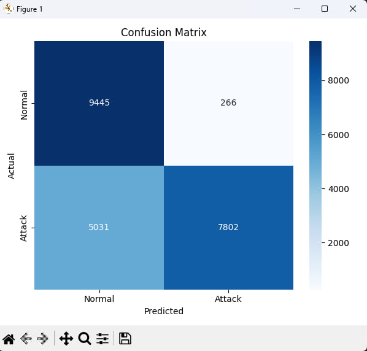
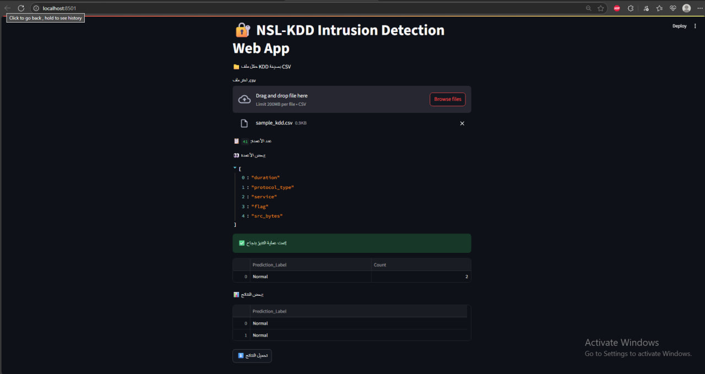

# 🔐 Système de Détection d’Intrusion basé sur NSL-KDD (SI-01-CYBER-2025)

Ce projet a pour objectif de détecter les attaques informatiques à partir du jeu de données NSL-KDD. Nous avons développé un modèle d’apprentissage automatique (Machine Learning) ainsi qu'une interface Web interactive avec Streamlit pour effectuer des prédictions à partir de fichiers CSV.

---

## 🧠 Objectif du Projet

- Analyser et prétraiter les données du jeu NSL-KDD
- Convertir les attributs catégoriels en variables numériques (One-Hot Encoding)
- Entraîner un modèle de classification pour distinguer le trafic normal du trafic malveillant
- Créer une interface utilisateur permettant de charger des fichiers `.csv` pour effectuer les prédictions en temps réel

---

## 🔍 Traitement et Entraînement

- 📌 Prétraitement des données avec `pandas` et `OneHotEncoder`
- 📌 Suppression des colonnes inutiles : `label`, `difficulty`
- 📌 Entraînement du modèle `RandomForestClassifier`
- 📌 Sauvegarde du modèle avec `joblib`

---

## 📊 Résultats

- **Précision du modèle (Accuracy)** : environ **76%**
- **Matrice de Confusion :**  
  

---

## 🖥️ Interface Web (Streamlit)

L'application Streamlit permet :

- de charger un fichier `.csv` contenant des connexions réseau
- de visualiser la prédiction pour chaque ligne : **Normal** ou **Attack**
- de télécharger le fichier avec les prédictions

### 🖼️ Capture d’écran :


---

## 🛠️ Technologies Utilisées

| Outil / Bibliothèque | Rôle |
|----------------------|------|
| Python               | Langage principal |
| pandas               | Traitement des données |
| scikit-learn         | Entraînement du modèle |
| joblib               | Sauvegarde du modèle et du préprocesseur |
| Streamlit            | Création de l'application Web |

---

## 🚀 Comment exécuter le projet


## 📁 Données et Modèles

Les fichiers de données volumineux et le modèle entraîné ne sont pas inclus dans ce dépôt GitHub pour des raisons de taille.

🔗 Vous pouvez les télécharger ici :  
[📥 Télécharger les fichiers NSL-KDD (Google Drive)](https://drive.google.com/drive/folders/TON-LIEN-ICI)

Ce dossier contient :
- KDDTrain+.txt
- KDDTest+.txt
- encoder.joblib
- rf_model.joblib
- X_train.npy / X_test.npy / y_train.npy / y_test.npy

```bash
# Installer les dépendances
pip install -r requirements.txt

# Prétraiter les données et entraîner le modèle
python preprocess_nsl_kdd.py
python train_model.py

# Lancer l’application Streamlit
streamlit run streamlit_app.py


